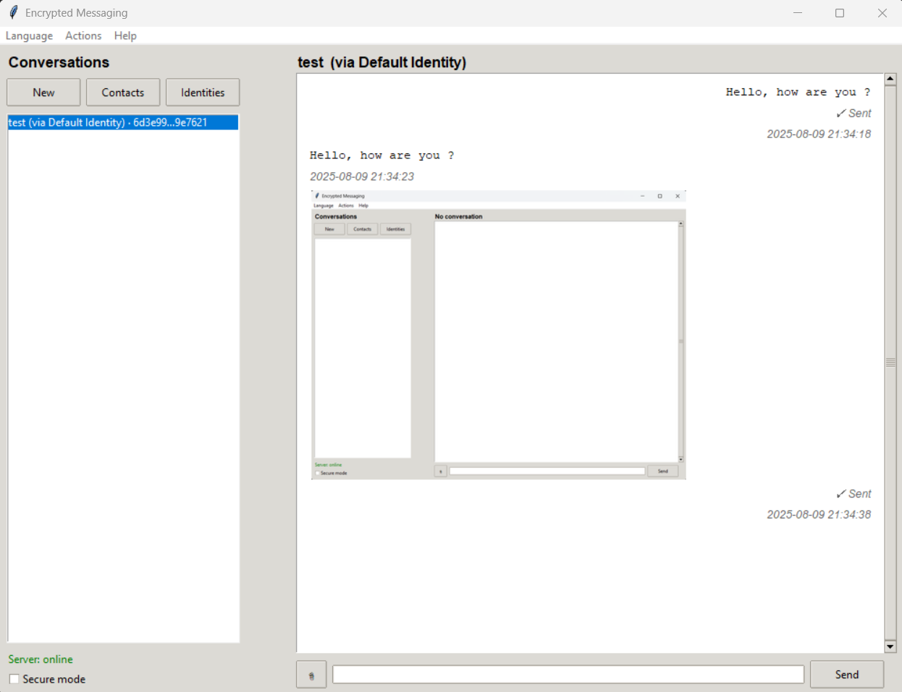

# Encrypted Messaging App

A minimal, privacy-first messaging system with **end-to-end encryption**, **sealed-sender-style anonymous submission**, and a simple **Tkinter** desktop client.

* Payloads (text/files + metadata) are **signed** (Ed25519) and **encrypted** (NaCl SealedBox / X25519).
* The server only sees: **recipient public key**, ciphertext, timestamps, and PoW nonce — **not** the sender identity.
* Multiple identities per client; each contact is bound to a chosen identity.
* Optional **Secure Mode** for “leave no trace” sessions.

---

## Table of Contents

- [Encrypted Messaging App](#encrypted-messaging-app)
   * [Table of Contents](#table-of-contents)
   * [Features](#features)
   * [How it works (TL;DR)](#how-it-works-tldr)
   * [Repository Layout](#repository-layout)
   * [Requirements](#requirements)
   * [Quick Start](#quick-start)
      + [1) Start the server](#1-start-the-server)
      + [2) Start the client](#2-start-the-client)
   * [Usage](#usage)
   * [Local Persistence (when not in secure mode)](#local-persistence-when-not-in-secure-mode)
   * [API (short)](#api-short)
   * [Screenshots](#screenshots)
   * [Build binaries with PyInstaller](#build-binaries-with-pyinstaller)
      + [Client (Windows)](#client-windows)
      + [Client (macOS/Linux)](#client-macoslinux)
      + [Server](#server)
   * [Troubleshooting](#troubleshooting)
   * [License](#license)
   * [Credits](#credits)

---

## Features

* **End-to-end encryption**

  * Client signs payloads with **Ed25519** and encrypts with **NaCl SealedBox (X25519)**.
  * Files/images and metadata (filename, MIME, type, timestamps) are encrypted too.

* **Sealed-sender (light)**

  * `/put` is **anonymous** (no auth headers).
  * Server does not learn who sent the message; it only knows the recipient mailbox.

* **Proof-of-Work (anti-abuse)**

  * Lightweight PoW on `/put` (leading-zero SHA-256). Mined in a background thread.

* **Multiple identities**

  * Create/manage several identities, each with its own Ed25519/X25519 keys.
  * Contacts are bound to the identity you’ll use to talk to them.

* **Conversations & files**

  * Send text, files, and images.
  * **Async sending** with UI that stays responsive.
  * Per-message status: **⌛ Sending… / ✓ Sent / ✗ Failed**.

* **Better conversations list**

  * **Unread badge** (e.g., `•3`) per conversation in the sidebar.
  * Conversations are **restored on restart** (when not in Secure Mode).

* **Contact quality of life**

  * **Improved contact picker** (search + double-click).
  * **“Add contact”** button appears when you chat with an **unknown** public key (not shown if already saved).

* **Internationalization (i18n)**

  * Live language switch (French/English) via menu.
  * Language files in `client/langs/` (`fr.json`, `en.json`).

* **Secure Mode (leave no trace)**

  * When **enabled**:

    * On activation and on next start, all local data (identities, contacts, conversations, local vault) are **purged**.
    * On **exit**, you’re warned and the same purge happens before closing.
    * Client still ACKs and can request server deletion after delivery.
  * When **disabled**:

    * The client keeps an **encrypted local vault** of conversations for fast restore at startup.

---

## How it works (TL;DR)

* **Server knows**: recipient box public key (routing), ciphertext, timestamps, PoW nonce.
* **Server verifies**: PoW for `/put`; signed headers for `/get`/`/ack`/`/delete`.
* **Client verifies**: sender’s payload signature (Ed25519) inside the ciphertext.
* For stronger network-level privacy, run the client over **Tor/VPN**.

---

## Repository Layout

```
server/
  app.py           # FastAPI app + endpoints
  config_db.py     # config loader + SQLite + schema
  security.py      # signature/Pow checks
  schemas.py       # Pydantic models

client/
  app.py           # app logic + Tk UI
  security.py      # crypto helpers, signed HTTP, PoW
  interface.py     # i18n + dialogs (Contacts, Identities, Contact picker)
  langs/
    fr.json
    en.json

docs/
  img/             # screenshots for README
```

---

## Requirements

* **Python 3.10+**
* Install deps:

```bash
python -m venv venv
# Windows:
venv\Scripts\activate
# macOS/Linux:
source venv/bin/activate

pip install -r requirements.txt
```

> Tkinter and sqlite3 ship with most Python builds.

---

## Quick Start

### 1) Start the server

```bash
cd server
python app.py
# default http://localhost:8000
```

`server/config.json` is created on first run:

```json
{
  "database": "messages.db",
  "port": 8000,
  "host": "0.0.0.0",
  "pow_difficulty": 5,
  "pow_window_secs": 120
}
```

### 2) Start the client

```bash
cd client
python app.py
```

`client/config.json` is created on first run:

```json
{
  "server_url": "http://localhost:8000",
  "polling_interval": 5,
  "language": "en",
  "secure_mode": false
}
```

---

## Usage

1. **Identities**
   Use **Identities** to add/rename/delete identities. The client auto-registers each identity to the server (`/register`) so it can fetch its mailbox.

2. **Contacts**
   In **Contacts**, add the contact name and their **box public key (hex)**, and pick which **identity** you’ll use.

   * If someone messages you first and you haven’t saved them, an **“Add contact”** button appears in the header; click it to save them.

3. **Conversations**
   Click **New** and select a contact. Send text or attach files/images.

   * Messages are sent **asynchronously**; UI shows **Sending / Sent / Failed** state.
   * Use **Actions → Refresh now** to force a fetch immediately. Otherwise, the client polls automatically.

4. **Secure Mode**
   Toggle **Secure mode** in the left pane.

   * When enabling, you’ll be warned; the client **purges** identities, contacts, and local conversations vault immediately.
   * On **startup** while secure mode is enabled, the client also ensures everything is purged.
   * On **exit** while secure mode is enabled, you’ll get an additional confirmation; if you proceed, everything is purged again.
   * When secure mode is **off**, the client keeps an **encrypted local vault** so conversations re-open with unread badges next time.

---

## Local Persistence (when not in secure mode)

* File: `client/conversations.vault` (encrypted with **libsodium SecretBox**).
* Key: `client/vault.key` (32 random bytes generated once).
* Stored data: conversations (including files/images as base64), unread counters, and last selected conversation.
* If you lose `vault.key`, the vault cannot be decrypted.

> In Secure Mode, both files are continuously **deleted** (on enable, on start, on exit).

---

## API (short)

* `GET /pow_salt` → `{ salt, difficulty, window_secs }`
* `POST /register` *(signed)* → `{ box_pub }`
* `POST /put` *(anonymous + PoW)*
* `POST /get` *(signed)* → `{ recipient }`
* `POST /ack` *(signed)* → `{ ids }`
* `POST /delete` *(signed)* → `{ ids }`

Signed endpoints require:

```
X-PubSign: <hex(Ed25519 verify key)>
X-Timestamp: <unix seconds>
X-Signature: <hex( Sign( f"{ts}.{sha256(body)}" ) )>
```

---

## Screenshots

<details>
  <summary>Toggle screenshots</summary>




</details>

---

## Build binaries with PyInstaller

> Run these from the **target folder** (`client/` or `server/`).
> On **Windows**, `--add-data` uses `;`. On **macOS/Linux**, use `:`.

### Client (Windows)

**One-file (recommended):**

```powershell
cd client

pyinstaller --clean --noconfirm ^
  --onefile ^
  --noconsole ^
  --name EncryptedClient ^
  --add-data "langs;langs" ^
  app.py
```

**One-dir (portable folder):**

```powershell
cd client

pyinstaller --clean --noconfirm `
  --onedir `
  --noconsole `
  --name EncryptedClient `
  --add-data "langs;langs" `
  app.py
```

**If PyInstaller misses modules, add:**

```powershell
--hidden-import "nacl.signing" --hidden-import "nacl.public" --hidden-import "nacl.bindings" --hidden-import "PIL._imaging"
```

### Client (macOS/Linux)

Replace `--add-data "langs;langs"` with:

```
--add-data "langs:langs"
```

### Server

```powershell
# Windows
cd server
pyinstaller --clean --noconfirm --onefile --name EncryptedServer app.py
```

```bash
# macOS/Linux
cd server
pyinstaller --clean --noconfirm --onefile --name EncryptedServer app.py
```

**Artifacts:**

* onefile: `dist/EncryptedClient(.exe)`, `dist/EncryptedServer(.exe)`
* onedir: `dist/EncryptedClient/EncryptedClient(.exe)`

**Runtime data locations**

* Client writes `config.json`, `identities.json`, `contacts.json`, and (when not in secure mode) `conversations.vault` + `vault.key` in the **current working directory**.
* Server creates `messages.db` beside `server/app.py` (or in the working directory when packaged).

---

## Troubleshooting

* **Client freezes when sending large files** → fixed by moving encryption/PoW/network to a background thread; ensure you’re running a recent build.
* **“Server: offline”** → verify server is running and `client/config.json` points to it.
* **PoW too slow** → lower `pow_difficulty` in `server/config.json`.
* **No languages in packaged client** → make sure `--add-data "langs;langs"` (or `langs:langs` on macOS/Linux) is present.
* **Vault errors** → check write permissions in the working dir; deleting `conversations.vault` + `vault.key` resets local history (only when not in secure mode).

---

## License

**AGPL-3.0-or-later** — see [LICENSE](./LICENSE).

---

## Credits

* Cryptography: **PyNaCl** (NaCl primitives: Ed25519, X25519/SealedBox)
* Web: **FastAPI** + Uvicorn
* UI: **Tkinter** + **Pillow**